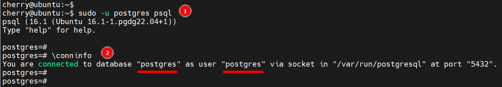
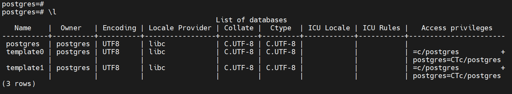
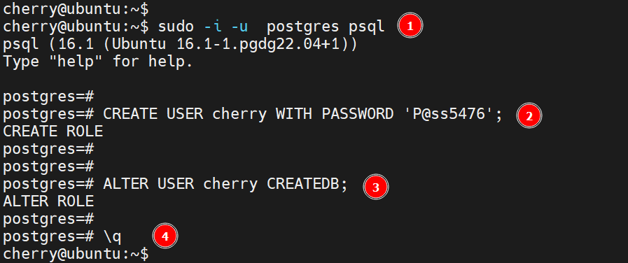

# Create PostgreSQL Database on Linux using Command Line

## Step 1: Login to PostgreSQL

```bash
sudo psql -U postgres
```

## Step 2: Create a new database

```bash
CREATE DATABASE new_database_name;

```

```bash
\conninfo
```



Verify the database

```bash
\l
```



Exit PostgreSQL

```bash
\q
```

## Step 3: Create a new user

```bash
CREATE USER new_user_name WITH PASSWORD 'new_user_password';
```

## Step 4: Grant privileges to the new user

```bash
GRANT ALL PRIVILEGES ON DATABASE new_database_name TO new_user_name;
```

```bash
ALTER USER new_user_name CREATEDB;
```

## Step 5: Verify the new user

```bash
\q
```



[BACK Main](db-main.md)
